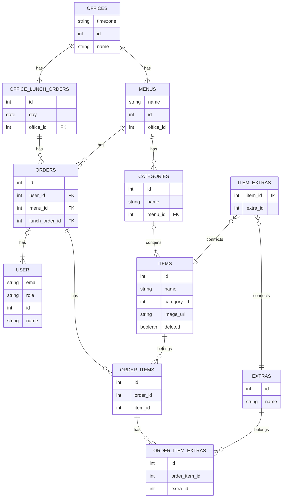

# lunchbot

Below is the database model for Lunchbot displayed using mermaid.js. You can modify the model by making changes in this .md file.

```mermaid
  erDiagram
    MENUS ||--o{ CATEGORIES : has
    MENUS ||--o{ ORDERS : has
    MENUS {
        string name
        int id
        int office_id
    }
    OFFICE_LUNCH_ORDERS ||--o{ ORDERS : has
    OFFICE_LUNCH_ORDERS {
        int id
        date day
        int office_id FK
    }
    USER {
      string email
      string role
      int id
      string name
    }
    ORDERS {
      int id
      int user_id FK
      int menu_id FK
      int lunch_order_id FK
    }
    ITEMS ||--o{ ORDER_ITEMS : belongs
    ORDER_ITEMS ||--o{ ORDER_ITEM_EXTRAS : has
    ORDER_ITEMS {
        int id
        int order_id
        int item_id
    }
    OFFICES ||--|{ MENUS: has
    OFFICES ||--|{ OFFICE_LUNCH_ORDERS: has
    OFFICES {
      string timezone
      int id
      string name
    }
    CATEGORIES |o--|{ ITEMS: contains
    CATEGORIES {
      int id
      string name
      int menu_id FK
    }
    ITEM_EXTRAS }o--|| EXTRAS: connects
    ITEM_EXTRAS }o--|| ITEMS: connects
    ORDERS ||--o{ ORDER_ITEMS : has
    EXTRAS ||--o{ ORDER_ITEM_EXTRAS: belongs
    ORDERS |o--|{ USER: has
    ITEMS {
      int id
      string name
      int category_id
      string image_url
      boolean deleted
    }
    ORDER_ITEM_EXTRAS {
      int id
      int order_item_id
      int extra_id
    }
    EXTRAS {
      int id
      string name
    }
    ITEM_EXTRAS{
      int item_id fk
      int extra_id
    }
```
